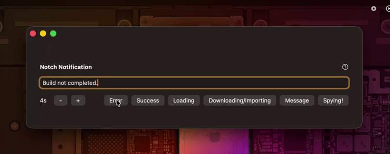

# NotchNotification Plus

Display notifications through the MacBook notch area.

The code has been refactored from [NotchDrop](https://github.com/Lakr233/NotchDrop) and modified to better suit the current use case.
</br>
</br>
This project was originally by [Lakr233](https://github.com/Lakr233/), I added some other notification types to the original, such as loading/syncing and importing/downloading, as well as fixing the notification icon on the Message mode being cut off.

## Demo Application


## Platforms

NotchNotification supports all AppKit platforms and works even on devices without a notch.

```swift
platforms: [.macOS(.v12)],
```

## Usage

To add this package to your project:

```swift
dependencies: [
    .package(url: "https://github.com/Lakr233/NotchNotification.git", from: "1.1.0"),
]
```

To display a notification, use the following code:

```swift
NotchNotification.present(message: message)
```

To display a loading/syncing notification, use the following code:

```swift
NotchNotification.present(loading: message)
```

To display a downloading/importing notification, use the following code:

```swift
NotchNotification.present(import: message)
```

For presenting an error notification with a custom interval:

```swift
NotchNotification.present(error: error, interval: 3)
```

To fully customize the notification view:

```swift
NotchNotification.present(
    bodyView: HStack {
        Image(systemName: "hand.point.right")
        Text(message).underline()
        Image(systemName: "hand.point.left")
    },
    interval: interval
)
```

## License

This project is licensed under the MIT License. See the [LICENSE](LICENSE) file for more details.

---

© 2024 Lakr Aream. All Rights Reserved.
© 2025 kingkwahli at NaazimCo
